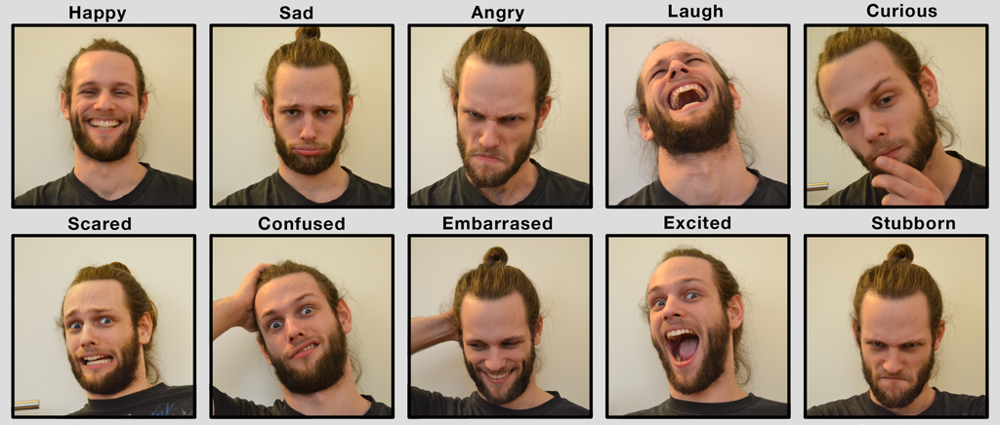
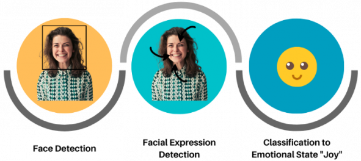
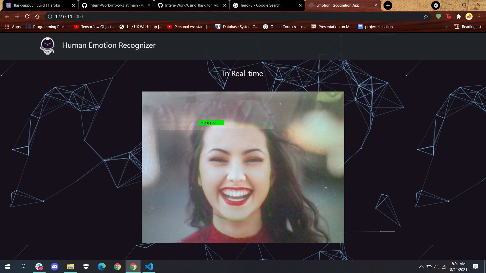
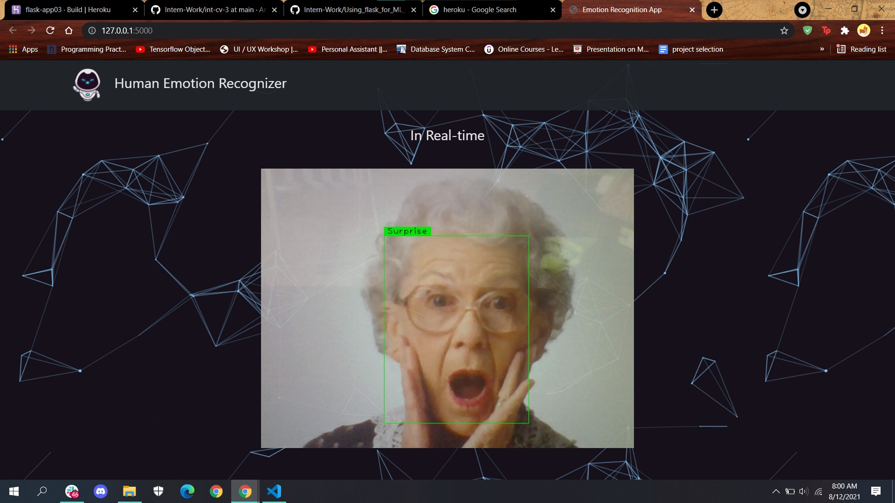

# STEP 1: EMOTION RECOGNITION OVERVIEW

## **WHAT IS FER?**
Facial Emotion Recognition (FER) is the technology that analyses facial expressions from
both static images and videos in order to reveal information on one’s emotional state.

 

&nbsp; 

## **IMPORTANCE & APPLICATION**
FER in general or computer-based FER system is important because of Facial expressions and other gestures convey nonverbal communication cues that play an important role in interpersonal relations. These cues complement speech by helping the listener to interpret the intended meaning of spoken words. Therefore, FER, because it extracts and analyzes information from an image or video feed, is able to deliver unfiltered, unbiased emotional responses as data.

Here mentioned are a few of its applications:
- Personalised services in smart environments 
    + movie/music recommendations
    + interactive marketing, advertising
    + mood-based personal assistants and many more
- Healthcare
    + to detect Autism or neurodegenerative diseases
    + predict psychotic disorders or depression
    + observe patients and their conditions during treatment, etc.
- Education 
    + monitor students’ attention
    + design affective tutoring system
    + detect engagement in online learning, etc.
- Public Safety & Crime Detection
    + lie detectors and smart border control
    + detect and reduce frauds
    + predictive screening of public spaces to identify emotions triggering potential terrorism threat
    + driver fatigue detection to prevent accidents, etc.

&nbsp;

## **UNDERSTANDING THE ALGORITHM**
The FER algorithm can be broken down into 3 major steps:
+ **Face Detection**  -  Locating faces in the scene, in an image or video footage
+ **Facial Landmark Detection**  -  Extracting information about facial features from detected faces (eg: end of nose, eyebrows, etc.)
+ **Facial Expression and Emotion Classification**  -  Analyzing the movement of facial features and/or changes in the appearance of facial features and classifying this information into 6 basic categories (ie. anger, disgust, fear, joy, sadness, and surprise)

 

 **WAYS TO IMPLEMENT THIS ALGORITHM:**
1. Using OpenCV libraries
1. Using Pre-trained Models (either direct models off the internet or models modified via transfer learning)
1. Building a DL model from scratch and training it on the dataset

Check out the [main.py](main.py) file for the code!!

&nbsp;

# STEP 2: INTEGRATING WITH FLASK

## **WHAT IS FLASK?**
Flask is a web application framework for Python which makes writing web applications alot easier without having to worry about the details like protocol management, thread management, etc. It gives is a variety of choices for developing web applications along with the necessary tools and libraries.

&nbsp;

## **WHY AND WHERE IS FLASK USED?**
Once the model is trained, it needs to be used too right!!
 For this reason, we need to make our model available to others. Our model should be able to take in input and return the output.

For example, You have to build a model that predicts whether to approve a loan for a customer or not. The model is trained on features like salary, dependents, loan amount and several other features then the model will be able to make predictions when you give input of these fields to the model. You have to give entries of features on which the model is trained then only it would be able to make predictions.

&nbsp;

## **HOW TO INTEGRATE?**
Here, 3 different files will be used, [camera.py](Flask-Real-time\camera.py) which contains code to control the input camera, ["templates"](Flask-Real-time\templates) folder which contains .html files to handle the structure of the web page and finally, [app.py](Flask-Real-time\app.py) which controls both the camera file and the templates folder along with the implicit working of our application (in our case, reading from the camera, processing the feed and performing FER).

 

 

&nbsp;

# STEP 3: DEPLOYMENT ON HEROKU

## **WHAT IS HEROKU?**
Heroku is a container-based cloud Platform as a Service (PaaS) that enables developers to build, run, deploy, manage, operate  and scale modern applications entirely in the cloud. It is a polyglot platform as it allows developers to build, run, and scale applications in most languages in a similar way. 

&nbsp;

## **WHY AND WHERE IS IT USED?**
While Flask handles only the server-side deployment of the app, Heroku is used to enable client-side deployment.  It enables developers to create and run complex web applications without worrying about the underlying hardware or networking.

&nbsp;

***Human Emotion Recogniser on Heroku:***
