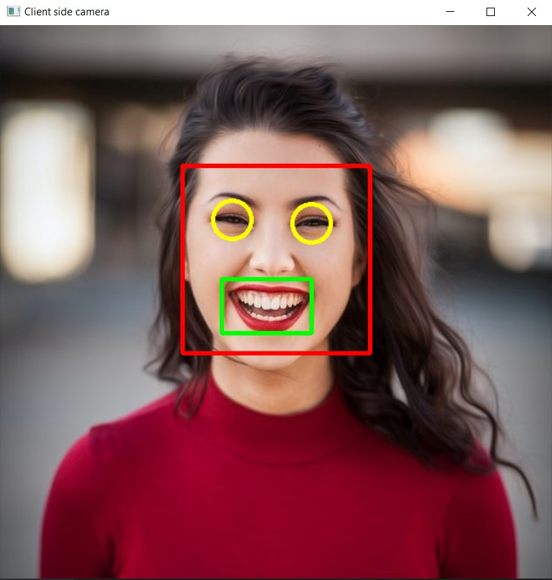

# Face Eye Lip Detection with PyZMQ 


In this session,

- We will perform face, eye and lip detection.
- Use *PyZMQ* to enable client-server communication.


## What is PyZMQ?

***PyZMQ*** is a python version of *ZeroMQ* which is a library used to set up messaging and communication between applications and processes quick and asynchronously. *ZeroMQ* is one the many methods available for file transfer in client-server models, one of the advantages being that it can be used for message queuing without using a message broker.


## 68 Landmarks of Face
As you can see in the image we have total 68 

landmarks on the face which is provided by the dlib shape_predictor. Each point corresponds to the point in the face. Since we are considered in only eyes and lips. We'll be drawing boxes around them only by using following points

- Lips -> width= P(54)-P(58), height = P(52)-P(57)
- Left Eye -> Radius = [P(39)-P(36)]/2
- Right Eye -> Radius = [P(45)-P(42)]/2

Since we know the coordinates we'll be able to draw boxes and circles around them.


### Required Libraries

Install these following dependencies used for our implementation on command prompt

```
pip install opencv-python
pip install cmake
pip install dlib
pip install zmq
```

Download the weights data file from this [link](https://github.com/Learn-Write-Repeat/Open-contributions/blob/master/Anshuman_OpenCV/FaceDetection_PyZMQ/shape_predictor_68_face_landmarks.dat) and place it in the folder where your client and server python file is.

## Implementation

- At first connections will be stabilised by opening sockets from client side and binding it to server end and connect them using IP.
 - Now client's camera will be on and it'll start sending the frames by converting it to buffer form
 - At server side as the buffer is received it is reconstructed into frame using numpy.
 - Now server performs all the detections and draws the boxes using dlib and cv2 and send back the frame to client using same buffer.
 - Again the client reconstructs frame from buffer and then displays it.

#### Client side code

```python
import cv2
import zmq
import numpy as np

img=cv2.imread('face.jpg')
#Takes an image input 
context= zmq.Context()
#Here we build the context for communication to server
socket = context.socket(zmq.REQ)
#From the context we create a request socket as we are client 
socket.connect("tcp://127.0.0.1:9999")
#For the example purpose we are taking port 9999 and localhost ip for sake of demonstration
#So far we have sent a connection req to server . As the server binds it we then can communicate


# THIS FUNCTION SENDS THE FRAME IMAGE TO THE ENDPOINT
def send_array(socket, A, flags=0, copy=True, track=False):
    md = dict(
        dtype = str(A.dtype),
        shape = A.shape,
    )
    # Made a dictionary of dtype of array and shape of array so that at server side we know
    # at the time of transforming array from  buffer we must know the shape to get it back.

    socket.send_json(md, flags|zmq.SNDMORE)
    #Sent the image using json to the server
    return socket.send(A, flags, copy=copy, track=track)
    # Finally sending the image in form of buffer to the server.

# THIS FUNCTION RECIEVIES THE ARRAY SENT FROM ANOTHER END
def recv_array(socket, flags=0, copy=True, track=False):
    md = socket.recv_json(flags=flags)
    # Recieves the json file containing dtype and shape of the required array
    msg = socket.recv(flags=flags, copy=copy, track=track)
    # msg is the buffer recived which contains the array
    A = np.frombuffer(msg, dtype=md["dtype"])
    # Using numpy and shape known  we transform the buffer into the array and reshape
    # it to required shape and then finally return it.
    return A.reshape(md['shape'])

# NOTE - If you wish to learn more about sending and receving arrays with zmq
#        then you can visit - https://pyzmq.readthedocs.io/en/latest/serialization.html

send_array(socket,img)
# Sent the frame to server for prediction and drawing boxes
frame = recv_array(socket)
# Recieved the frame with boxes drawn around face, eyes and lips
cv2.imshow('Client side camera ', frame)
# Show the frame to client
cv2.waitKey(0)
cv2.destroyAllWindows()
# Release the webcam cameras
```


#### Server side code

```python
import dlib, cv2
import socket , zmq
import numpy as np

getface = dlib.get_frontal_face_detector()
# Get a front face detector with dlib
getlandmark= dlib.shape_predictor("./shape_predictor_68_face_landmarks.dat")
# Get a landmark predictor from the dat file to get 68 landmarks of the face


context= zmq.Context()
#Here we build the context for communication to server
socket = context.socket(zmq.REP)
#From the context we create a socket through which other clients will be connected 
socket.bind("tcp://127.0.0.1:9999")
#For the example purpose we are taking port 9999 and localhost ip for sake of demonstration
#So far we have set up connection which listens to the ip and binds with it.


# THIS FUNCTION SENDS THE FRAME IMAGE TO THE ENDPOINT
def send_array(socket, A, flags=0, copy=True, track=False):
    md = dict(
        dtype = str(A.dtype),
        shape = A.shape,
    )
    socket.send_json(md, flags|zmq.SNDMORE)
    return socket.send(A, flags, copy=copy, track=track)

# THIS FUNCTION RECIEVIES THE ARRAY SENT FROM ANOTHER END
def recv_array(socket, flags=0, copy=True, track=False):
    md = socket.recv_json(flags=flags)
    msg = socket.recv(flags=flags, copy=copy, track=track)
    A = np.frombuffer(msg, dtype=md["dtype"])

    return A.reshape(md['shape'])
    
frame = recv_array(socket)
# Recieve the cam frame from the client
gray = cv2.cvtColor(frame, cv2.COLOR_BGR2GRAY)
#Converted the frame to gray for detection
faces= getface(gray)
# Detect all the faces in the frame

#Loop over each face
for face in faces:
    x, y= face.left(), face.top()
    w, h= face.right()-x, face.bottom()-y
    #Get cordinates of the face along with length and width 
    frame = cv2.rectangle(frame, (x,y), (x+w,y+h),(0,0,255),3)
    # Draw a rectangle over the detected face

    landmarks = getlandmark(gray, face)
    # Get all 68 points of face from the prdictor by passing the image and face 

    hx= landmarks.part(48).x-10
    hy= landmarks.part(51).y-10
    ww= landmarks.part(54).x-landmarks.part(48).x+10
    hh = landmarks.part(57).y- landmarks.part(51).y+10
    #Getting the cordinates of lips of the face taking +10 margin (Refer to figure in the mardown file for landmard positions)

    frame= cv2.rectangle(frame, (hx,hy),(hx+ww,hy+hh),(0,255,0),3)
    #Draw a rectangle over the lips
    
    hx= (landmarks.part(37).x+landmarks.part(40).x)//2
    hy= (landmarks.part(37).y+landmarks.part(40).y)//2
    radius = (landmarks.part(39).x-landmarks.part(36).x+10)//2
    # Getting the cordinates of the left eye and radius to draw the circle
    

    frame= cv2.circle(frame, (hx,hy),radius ,(0,255,255),3)
    # Drawing a circle around the left eye  

    hx= (landmarks.part(43).x+landmarks.part(46).x)//2
    hy= (landmarks.part(43).y+landmarks.part(46).y)//2
    radius= (landmarks.part(45).x-landmarks.part(42).x+10)//2
    # Getting the cordinates of the right eye and radius to draw the circle

    frame= cv2.circle(frame, (hx,hy),radius,(0,255,255),3)
    # Drawing a circle around the right eye  

send_array(socket,frame)	
```

Note: Run the server side program first and then run the client side program. The client side code will take an image input and send it to server to get it processed. The image will get processed in the server side and then it will send it back to the client. The client will then display the processed image as an output.

Input image sent to server             | Output image received from server 
:-------------------------:|:-------------------------:
  |  


