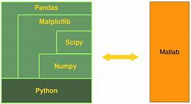
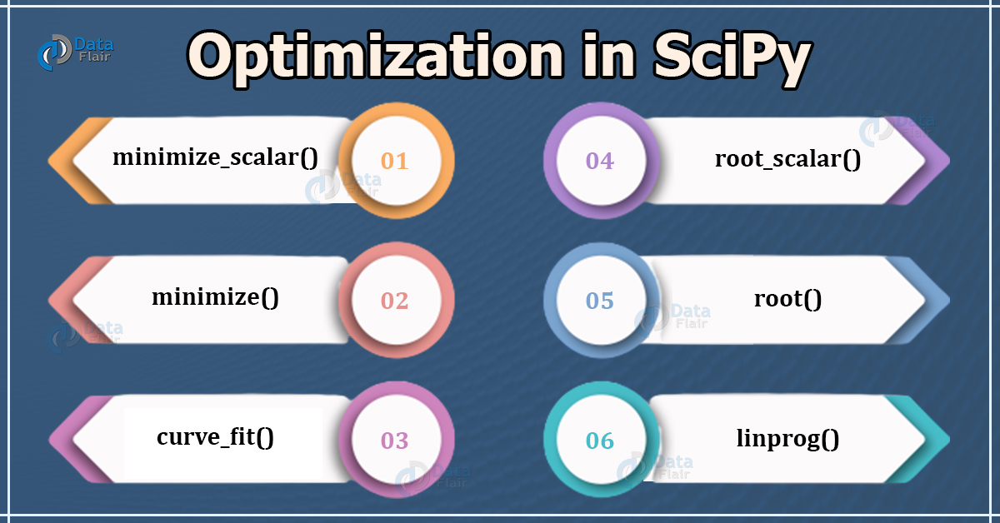
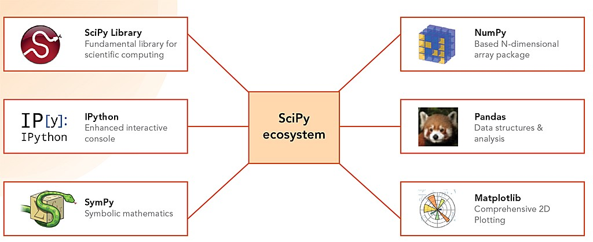
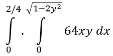

# SciPy

# HISTORY OF SciPy:

- **Travis Oliphant**, **Eric Jones**, and **Pearu Peterson** merged code they had written and called the new package **SciPy**. 
- The newly created package provided a standard collection of common numerical operations on the top of Numpy.

# What is SciPy?

- SciPy is an open-source scientific library of Python that is distributed under a BSD license. 
- It is used to solve complex scientific and mathematical problems. 
- It is built on top of the Numpy extension, which means if we import the SciPy, there is no need to import Numpy. 
- The **Scipy** is pronounced as **Sigh pi**, and it depends on the Numpy, including the appropriate and fast N-dimension array manipulation.
- It provides many user-friendly and effective numerical functions for numerical integration and optimization.
- The **SciPy** library supports **integration, gradient optimization, special functions, ordinary differential equation solvers, parallel programming tools** etc.
- The scipy is a data-processing and system-prototyping environment similar to MATLAB. 
- It is easy to use and provides great flexibility to scientists and engineers.

# Why is SciPy used?

- SciPy contains significant mathematical algorithms which provide easiness to develop convenient and dedicated applications. 
- Being an open-source library, it has a large community across the world to the development of its additional module, and it is beneficial for scientific application and data scientists.

# Numpy vs SciPy :

- Numpy and SciPy both are used for mathematical and numerical analysis. Numpy is suitable for basic operations such as sorting, indexing and many more because it contains array data, whereas SciPy consists of all the numeric data.
- Numpy contains many functions that are used to resolve the linear algebra, Fourier transforms, etc. whereas the SciPy library contains a full featured version of the linear algebra module as well many other numerical algorithms.

# SUB PACKAGES IN SciPy:

There are different sub packages in SciPy. Few of them are:

|**SUB PACKAGE**|**DESCRIPTION**|
| :-: | :-: |
|scipy.cluster|Cluster algorithms are used to vector quantization/ Kmeans.|
|scipy.constants|It represents physical and mathematical constants.|
|scipy.fftpack|It is used for Fourier transform.|
|scipy.integrate|Integration routines|
|scipy.interpolation|Interpolation|
|scipy.linalg|It is used for linear algebra routines.|
|scipy.io|It is used for data input and output.|
|scipy.ndimage|It is used for the n-dimension image.|
|scipy.odr|Orthogonal distance regression.|
|scipy.optimize|It is used for optimization.|
|scipy.signal|It is used in signal processing.|
|scipy.sparse|Sparse matrices and associated routines.|
|scipy.spatial|Spatial data structures and algorithms.|
|scipy.special|Special Function.|
|scipy.stats|Statistics.|
|scipy.weaves|It is a tool for writing.|

|**NOTE:The basic data structure used by SciPy is a multidimensional array provided by the NumPy module. NumPy provides some functions for Linear Algebra, Fourier Transforms and Random Number Generation, but not with the generality of the equivalent functions in SciPy.**|
| - |

# BASIC FUNCTIONALITY:

- All the NumPy functions have been available through the SciPy namespace.
- There is no need to import the NumPy functions explicitly, when SciPy is imported. 
- The main object of NumPy is the homogeneous multidimensional array. 
- In NumPy, dimensions are called axes. The number of axes is called the rank.
- As SciPy is built on top of NumPy arrays, understanding of NumPy basics is necessary.

# **NumPy Vector:**
A Vector can be created in multiple ways.
# Converting Python array-like objects to NumPy
**EXAMPLE:**

|
import numpy as np

list = [5,6,7,8]

arr = np.array(list)

print arr
|
| :- |

**OUTPUT:**

[5 6 7 8]

# SciPy ECOSYSTEM:

## **Intrinsic NumPy Array Creation:**
## **Using zeros()**
The zeros(shape) function will create an array filled with 0 values with the specified shape. The default dtype is float64.

**EXAMPLE:**

|
import numpy as np

print np.zeros((2, 3))
|
| :- |

**OUTPUT:**

array([[ 0., 0., 0.],

[ 0., 0., 0.]])
## **Using ones():**
The ones(shape) function will create an array filled with 1 value. It is identical to zeros in all the other respects. 

**EXAMPLE:**

|
import numpy as np

print np.ones((2, 3))
|
| :- |
**OUTPUT:**

array([[ 1., 1., 1.],

[ 1., 1., 1.]])

# IMPORTANT PACKAGES:
## **File Input / Output package:**
Scipy, I/O package, has a wide range of functions for work with different file formats which are Matlab, Arff, Wave, Matrix Market, IDL, NetCDF, TXT, CSV and binary format.
## **Special Function package**
- scipy.special package contains numerous functions of mathematical physics.
- SciPy's special functions include Cubic Root, Exponential, Log sum Exponential, Lambert, Permutation and Combinations, Gamma, Bessel, hypergeometric, Kelvin, beta, parabolic cylinder, Relative Error Exponential, etc..

## **Cubic Root Function:**
SYNTAX:

|scipy.special.cbrt(x)|
| :- |

- Cubic Root function finds the cube root of values.
## **Exponential Function:**
Exponential function computes the 10\*\*x element-wise.

**EXAMPLE:**

|
from scipy.special import exp10

#define exp10 function and pass value in its

exp = exp10([1,10])

print(exp)
|
| :- |

**OUTPUT:**

[1.e+01 1.e+10]
## **Permutations & Combinations:**
SciPy also gives functionality to calculate Permutations and Combinations.

**Combinations:** 
**
` `scipy.special.comb(N,k**)**

**EXAMPLE:**

|
from scipy.special import comb

#find combinations of 5, 2 values using comb(N, k)

com = comb(5, 2, exact = False, repetition=True)

print(com)
|
| :- |

**OUTPUT:** 

15.0

# Permutations :

**scipy.special.perm(N,k)**

**EXAMPLE:**

|
from scipy.special import perm

#find permutation of 5, 2 using perm (N, k) function

per = perm(5, 2, exact = True)

print(per)
|
| :- |

**OUTPUT:** 

20
## **Log Sum Exponential Function:**
Log Sum Exponential computes the log of sum exponential input element.

**SYNTAX:**

scipy.special.logsumexp(x) 
## **Bessel Function:**
Nth integer order calculation function

**SYNTAX**:

scipy.special.jn()

# EXAMPLE FOR SciPy MODULE :
# **Integration with Scipy – Numerical Integration**
- When we integrate any function where analytically integrate is not possible, we need to turn for numerical integration
- SciPy provides functionality to integrate functions with numerical integration.

**Example: Now take an example of Single Integration**

Here a is the upper limit and b is the lower limit

|
from scipy import integrate

# take f(x) function as f

f = lambda x : x\*\*2

#single integration with a = 0 & b = 1  

integration = integrate.quad(f, 0 , 1)

print(integration)
|
| :- |

**Output:**

(0.33333333333333337, 3.700743415417189e-15)

# Example of double integration:

|
from scipy import integrate

import numpy as np

#import square root function from math lib

from math import sqrt

# set  function f(x)

f = lambda x, y : 64 \*x\*y

# lower limit of second integral

p = lambda x : 0

# upper limit of first integral

q = lambda y : sqrt(1 - 2\*y\*\*2)

# perform double integration

integration = integrate.dblquad(f , 0 , 2/4,  p, q)

print(integration)
|
| :- |

**Output:**

(3.0, 9.657432734515774e-14)

